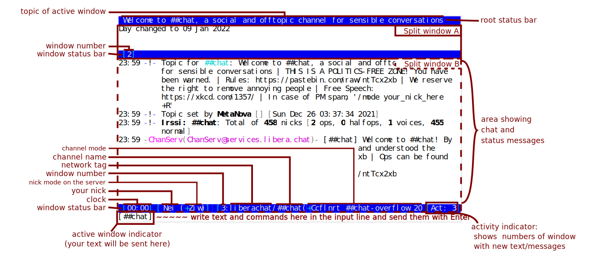

# User interface

Here is a screenshot of the default Irssi user interface, with all the
major visible things annotated.

---

topic
: channels often configure a topic with more information about the channel. Type `/t` (short for `/topic`) to read the full topic

window number
: each window ("Tab") in Irssi has a number. You can go to a window by number by typing `/<number>` (e.g. `/2`). To change the number, see [window number changing](./documentation/help/window_moving/)

channel mode
: the channel mode is a protocol-specific list of letters and arguments to configure the channel behaviour. Each network may have its own custom channel modes. See [IRC Client Protocol -- Channel Modes](https://modern.ircdocs.horse/#channel-modes) for some common modes and your network website for network-specific modes. Note, the status bar does **not** show *list* modes (like bans) nor *channel membership prefixes* (like channel operator).

channel name
: the name of the channel that you are joined to

network tag
: the Irssi-internal name tag assigned to your current connection/network

user mode
: the user mode is a protocol-specific global list of letters that reflect properties of your nick/connection. Each network may have its own custom nick modes. See [IRC Client Protocol -- User Modes](https://modern.ircdocs.horse/#user-modes) for some common modes. You can use `/set usermode` in Irssi to configure your desired default user mode or `/umode` to change your current user mode (where permissible; not all mode letters can be changed by yourself).

your nick
: your current nick name on the server. You can set your default nick with `/set nick` in Irssi and change your current nick with `/nick`.

clock
: shows the time on the computer where Irssi is running

active window indicator
: shows where any text you enter will be sent to

activity indicator
: this list will tell you about new messages in windows that are currently not visible. It reads `Act: 1,2,3,5,7,...`. Each number that lights up indicates that there are unread messages in that window. The colour of the number depends on the type of message -- white/black: regular text, cyan: status messages, magenta: hilights or private messages

root status bar
: the root status bar type is a status line that is either at the very top or at the very bottom of your screen. if the root status bar contains window-specific information, it will always refer to the currently active window

window status bar
: the window status bar type is a status line that is either at the top or bottom of a split window. if you create a window type status bar, it will be replicated on all inactive split windows. window status bars can show information specific to the window that they belong to. See [Help: statusbar](./documentation/help/statusbar/) for help on configuring the status bar.

split window
: multiple windows can be shown on the Irssi screen at the same time. See [Help: window](./documentation/help/window/) for help on managing windows.
